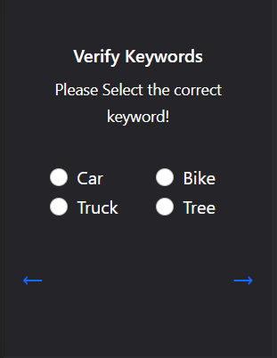
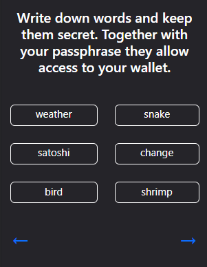
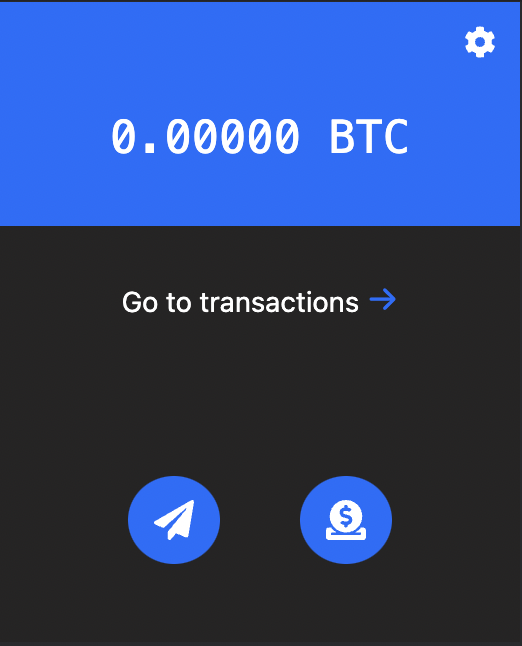

# KaiOS Crypto Wallet

This repository contains the frontend of the Kaios Wallet application that is used to store cryptocurrency. This project is under construction, please read the instructions to see the progress report of the project.

## Checklist

- [X] UI design for KaiOS wallet
- [ ] Add functionality for create wallet
- [ ] Add functionality for import wallet
- [ ] Battle test the functionalities

## Screenshots of the application

